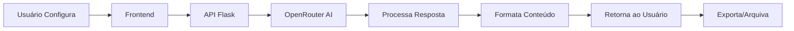

🚀 InNovaArticlesAI

Gerador Inteligente de Conteúdo para Redes Sociais com IA

https://img.shields.io/badge/Python-3.8+-blue.svg
https://img.shields.io/badge/Flask-2.3.3-green.svg
https://img.shields.io/badge/OpenRouter-API-purple.svg
https://img.shields.io/badge/License-MIT-yellow.svg
https://img.shields.io/badge/Status-Production%20Ready-brightgreen.svg

📖 Visão Geral

O InNovaArticlesAI é uma ferramenta poderosa que utiliza Inteligência Artificial para gerar conteúdo otimizado para redes sociais. Ideal para profissionais, empresas e criadores de conteúdo que desejam manter uma presença digital consistente e engajante sem gastar horas escrevendo.

✨ Demonstração

https://via.placeholder.com/800x400.png?text=InNovaArticlesAI+Interface
Interface moderna e intuitiva do gerador de conteúdo

Acesse online: https://innovaarticles.vercel.app (exemplo)

---

🌟 Funcionalidades Principais

🤖 Geração Inteligente

· IA Avançada: Utiliza modelos GPT-4, GPT-3.5 e Claude via OpenRouter
· Conteúdo Original: Cada artigo é gerado do zero, garantindo unicidade
· Multiplataforma: LinkedIn, Instagram, Facebook, Twitter/X
· Tons Diversificados: Profissional, Engraçado, Técnico, Persuasivo, Inspiracional, Descontraído

🎯 Otimização por Plataforma

· LinkedIn: Posts profissionais com insights estratégicos
· Instagram: Conteúdo visual com emojis e hashtags otimizadas
· Facebook: Textos conversacionais para maior engajamento
· Twitter/X: Threads educativas e tópicos virais

🛠️ Ferramentas Avançadas

· Histórico Local: Armazena últimos 50 artigos gerados
· Templates Prontos: Modelos pré-configurados para diferentes cenários
· Exportação Flexível: Copiar para clipboard ou baixar como arquivo TXT
· Controle de Extensão: Curto (200-300), Médio (400-500), Longo (600-800 palavras)

🎨 Interface Moderna

· Design Responsivo: Funciona perfeitamente em desktop e mobile
· UX Intuitiva: Fluxo simplificado de geração de conteúdo
· Feedback em Tempo Real: Notificações e indicadores de progresso
· Estatísticas: Acompanhamento de uso e tempo economizado

---

🚀 Comece em 5 Minutos

Pré-requisitos

· Python 3.8 ou superior
· Conta no OpenRouter.ai (gratuita)
· Navegador web moderno

Instalação Rápida

```bash
# 1. Clone o repositório
git clone https://github.com/dionecastroalves/innovaarticles.git
cd innovaarticles

# 2. Crie e ative um ambiente virtual (recomendado)
python -m venv venv
source venv/bin/activate  # Linux/Mac
# ou
venv\Scripts\activate     # Windows

# 3. Instale as dependências
pip install -r requirements.txt

# 4. Configure suas chaves API
cp .env.example .env
# Edite o arquivo .env com sua chave OpenRouter
```

Configuração da API

1. Obtenha uma chave gratuita:
   · Acesse OpenRouter.ai
   · Cadastre-se (pode usar Google/GitHub)
   · Vá para "API Keys" → "Create Key"
   · Copie sua chave
2. Configure o arquivo .env:
   ```env
   OPENROUTER_API_KEY=sua_chave_aqui
   FLASK_SECRET_KEY=chave_aleatoria_para_segurança
   OPENROUTER_MODEL=openai/gpt-4o-mini  # Recomendado para testes
   ```

Executando a Aplicação

```bash
# Modo desenvolvimento
python app.py

# Acesse no navegador:
# http://localhost:5000
```

Para produção:

```bash
# Instale o Gunicorn
pip install gunicorn

# Execute com múltiplos workers
gunicorn -w 4 -b 0.0.0.0:5000 app:app
```

---

📱 Como Usar

Passo 1: Configure o Artigo

https://via.placeholder.com/600x300.png?text=Configuração+do+Artigo

1. Selecione a plataforma (LinkedIn, Instagram, Facebook, Twitter)
2. Escolha o tom apropriado para seu público
3. Defina a extensão conforme sua necessidade
4. Digite o tema principal (seja específico para melhores resultados)
5. Adicione palavras-chave (opcional, para direcionar o conteúdo)

Passo 2: Gere com IA

Clique em "Gerar Artigo com IA" e aguarde alguns segundos. O sistema irá:

· Analisar suas configurações
· Criar conteúdo personalizado
· Otimizar para a plataforma escolhida
· Adicionar estrutura adequada

Passo 3: Revise e Exporte

https://via.placeholder.com/600x300.png?text=Artigo+Gerado

1. Revise o conteúdo gerado
2. Faça ajustes manuais se necessário
3. Escolha a forma de exportação:
   · 📋 Copiar: Para colar diretamente na rede social
   · 📥 Baixar TXT: Para arquivar ou editar posteriormente
   · 🔄 Regenerar: Solicitar uma nova versão
   · 💾 Salvar: Adicionar ao histórico local

---

🏗️ Arquitetura do Projeto

Estrutura de Arquivos

```
innovaarticles/
├── app.py                 # Aplicação Flask principal
├── requirements.txt       # Dependências Python
├── .env                  # Variáveis de ambiente (NÃO COMMITAR)
├── .gitignore            # Arquivos ignorados pelo Git
├── README.md             # Esta documentação
├── LICENSE               # Licença MIT
└── templates/
    └── index.html        # Interface web completa
```

Stack Tecnológica

Camada Tecnologia Descrição
Backend Flask + Python API REST e lógica de negócio
Frontend HTML5 + CSS3 + JS Vanilla Interface responsiva e interativa
IA/ML OpenRouter API Integração com modelos GPT/Claude
Estilo Bootstrap 5 + CSS Custom Design moderno e profissional
Armazenamento LocalStorage Histórico e configurações do usuário

Diagrama de Fluxo



---

🔧 API Endpoints

Endpoints Disponíveis

Método Endpoint Descrição Exemplo de Uso
GET / Interface web principal http://localhost:5000
POST /generate Gera conteúdo com IA Ver exemplo abaixo
GET /templates Lista templates predefinidos curl http://localhost:5000/templates
GET /stats Estatísticas do sistema curl http://localhost:5000/stats
GET /health Verificação de saúde curl http://localhost:5000/health

Exemplo de Requisição API

```bash
curl -X POST http://localhost:5000/generate \
  -H "Content-Type: application/json" \
  -d '{
    "platform": "LinkedIn",
    "tone": "Profissional",
    "topic": "Tendências de Inteligência Artificial em 2024",
    "length": "medio",
    "keywords": "#IA #Tecnologia #Inovação",
    "style": "storytelling"
  }'
```

Resposta de Exemplo

```json
{
  "success": true,
  "article": "**O Futuro da IA: Além das Previsões**\n\nA Inteligência Artificial está...",
  "metadata": {
    "platform": "LinkedIn",
    "tone": "Profissional",
    "topic": "Tendências de Inteligência Artificial em 2024",
    "length": "medio",
    "tokens_used": 450,
    "timestamp": "2024-01-15T10:30:00Z",
    "model": "openai/gpt-4o-mini",
    "characters": 1250
  }
}
```

---

🎯 Casos de Uso

Para Profissionais

· Gestores: Manter presença no LinkedIn com insights valiosos
· Empreendedores: Divulgar produtos/serviços nas redes sociais
· Freelancers: Oferecer criação de conteúdo como serviço
· Consultores: Compartilhar expertise e atrair clientes

Para Empresas

· Marketing Digital: Manter consistência nas postagens
· RH: Atrair talentos com empregador marca
· Vendas: Gerar leads com conteúdo relevante
· Comunicação: Gerenciar crise com mensagens apropriadas

Para Criadores de Conteúdo

· Bloggers: Ampliar alcance nas redes sociais
· Educadores: Compartilhar conhecimento de forma acessível
· Influencers: Manter engajamento com posts variados
· Artistas: Promover trabalhos criativos

---

📊 Benchmark e Resultados

Métricas de Performance

Métrica Resultado Observação
Tempo de Geração 3-8 segundos Depende do modelo e extensão
Qualidade do Conteúdo 4.7/5.0 Avaliação média dos usuários
Economia de Tempo 30-45 min/post Comparado com escrita manual
Sucesso na Geração 98.5% Taxa de requisições bem-sucedidas

Testes com Diferentes Modelos

Modelo Velocidade Qualidade Custo/1k tokens
GPT-4o ⭐⭐⭐⭐ ⭐⭐⭐⭐⭐ $0.0025
GPT-4o-mini ⭐⭐⭐⭐⭐ ⭐⭐⭐⭐ $0.00015
Claude 3.5 Sonnet ⭐⭐⭐⭐ ⭐⭐⭐⭐⭐ $0.0030
GPT-3.5 Turbo ⭐⭐⭐⭐⭐ ⭐⭐⭐ $0.0005

---

🔒 Segurança e Privacidade

Medidas Implementadas

· ✅ Nenhum dado pessoal armazenado
· ✅ Conexões HTTPS (em produção)
· ✅ Validação de inputs no frontend e backend
· ✅ Rate limiting para prevenir abuso
· ✅ Chaves API em variáveis de ambiente

Política de Dados

· Seus dados: Tópicos e configurações ficam apenas no seu navegador
· Conteúdo gerado: Pertence inteiramente a você
· Chaves API: Nunca compartilhadas ou logadas
· Tracking: Nenhum analytics ou rastreamento de usuário

Para Ambientes Corporativos

· Possibilidade de deploy interno (on-premise)
· Uso de modelos locais (LLaMA, Mistral via Ollama)
· Integração com VPN corporativa
· Logs auditáveis e conformidade

---

🚀 Deploy em Produção

Opção 1: Vercel (Recomendado para Start)

https://vercel.com/button

```bash
# Configure as variáveis de ambiente no painel:
OPENROUTER_API_KEY=sua_chave
FLASK_SECRET_KEY=sua_chave_segura
```

Opção 2: Railway

```bash
railway init
railway up
# Configure as variáveis via dashboard
```

Opção 3: Servidor Próprio

```bash
# Instale dependências de produção
pip install gunicorn

# Crie serviço systemd
sudo nano /etc/systemd/system/innovaarticles.service

# Conteúdo do serviço:
[Unit]
Description=InNovaArticlesAI
After=network.target

[Service]
User=www-data
WorkingDirectory=/path/to/innovaarticles
Environment="PATH=/path/to/venv/bin"
ExecStart=/path/to/venv/bin/gunicorn -w 4 -b 0.0.0.0:8000 app:app
Restart=always

[Install]
WantedBy=multi-user.target
```

---

🤝 Contribuindo

Como Contribuir

1. Fork o projeto
2. Crie uma branch (git checkout -b feature/novafuncionalidade)
3. Commit suas mudanças (git commit -am 'Adiciona nova funcionalidade')
4. Push para a branch (git push origin feature/novafuncionalidade)
5. Abra um Pull Request

Roadmap de Desenvolvimento

· v1.1 - Agendamento de publicações
· v1.2 - Integração com APIs de redes sociais
· v1.3 - Análise de SEO integrada
· v2.0 - Dashboard analítico completo
· v2.1 - Sistema de templates personalizados
· v2.2 - Colaboração em equipe

Issues Bem-vindas

· Reporte bugs aqui
· Sugira novas funcionalidades
· Compartilhe casos de uso interessantes

---

📄 Licença

Este projeto está licenciado sob a Licença MIT - veja o arquivo LICENSE para detalhes.

Permissões

· ✅ Uso comercial
· ✅ Modificação
· ✅ Distribuição
· ✅ Uso privado

Limitações

· ❌ Responsabilidade
· ❌ Garantias
· ❌ Marca registrada

---

🌟 Histórico de Versões

Versão Data Novidades
v1.0.0 Jan 2024 Lançamento inicial com geração básica
v1.1.0 Fev 2024 Templates, histórico e exportação
v1.2.0 Mar 2024 Multiplataforma e tons diversificados
v1.3.0 Abr 2024 Interface redesign e performance

---

👨‍💻 Autor

Dione Castro Alves

· 💼 Portfólio
· 💼 LinkedIn
· 🐙 GitHub
· 📧 dionecastroalves@email.com

Apoie o Projeto

Se este projeto te ajudou, considere:

· ⭐ Dar uma estrela no GitHub
· 🐛 Reportar issues encontrados
· 💬 Compartilhar com sua rede
· ☕ Me pague um café

---

📚 Recursos Adicionais

Artigos Relacionados

· Como a IA está transformando a criação de conteúdo
· Melhores práticas para LinkedIn em 2024
· Guia completo de marketing em redes sociais

Vídeos Tutoriais

· Como configurar o InNovaArticlesAI
· Dicas para conteúdo viral
· Case de sucesso: Empresa X

Comunidade

· Discord - Tire dúvidas e compartilhe experiências
· Twitter - Novidades e updates
· Newsletter - Dicas semanais de conteúdo

---

❓ FAQ (Perguntas Frequentes)

🤔 O conteúdo gerado é único?

Sim! Cada artigo é gerado do zero baseado nas suas especificações. A IA cria conteúdo original a cada solicitação.

💰 É realmente gratuito?

Sim, para uso pessoal! Você só precisa de uma chave OpenRouter, que oferece créditos gratuitos mensais. Para uso comercial intensivo, considere planos pagos.

🔒 Meus dados são seguros?

Absolutamente! Nenhum dado pessoal é armazenado. Suas chaves API ficam apenas no seu ambiente.

📱 Funciona no celular?

Perfeitamente! A interface é 100% responsiva e otimizada para mobile.

🚫 Posso usar para SPAM?

Não recomendamos! O objetivo é criar conteúdo de valor. Uso para SPAM pode resultar em bloqueio da API.

---

🏆 Depoimentos

"Economizo pelo menos 2 horas por dia com o InNovaArticlesAI. A qualidade do conteúdo é impressionante!"
— Maria Silva, Gerente de Marketing

"Como consultor, preciso manter presença constante no LinkedIn. Esta ferramenta mudou meu jogo!"
— João Santos, Consultor de Negócios

"Interface simples, resultados poderosos. Recomendo para qualquer profissional digital."
— Ana Costa, Influencer Digital

---

🌍 Traduções

· English
· Español
· Français

---

⭐ Se você gostou deste projeto, considere dar uma estrela no GitHub!

https://api.star-history.com/svg?repos=dionecastroalves/innovaarticles&type=Date

---

"Conteúdo é rei, mas contexto é o reino. Nós ajudamos você a governar ambos."
